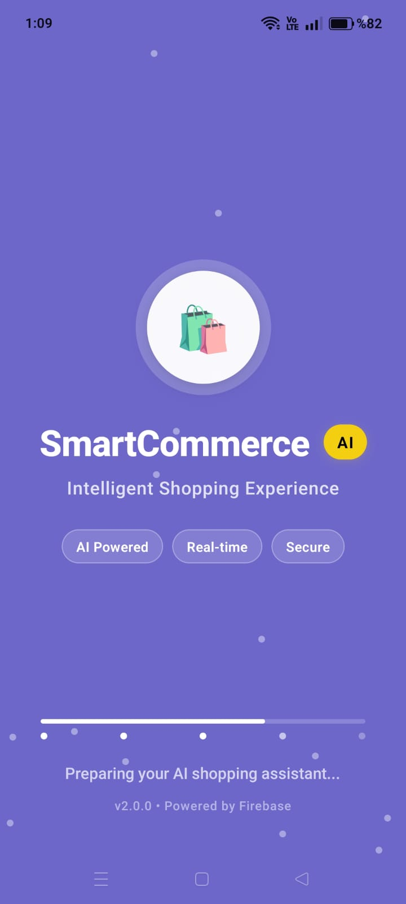
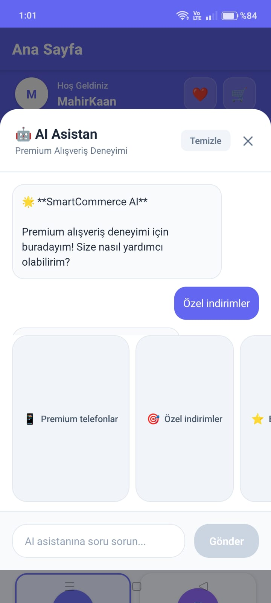
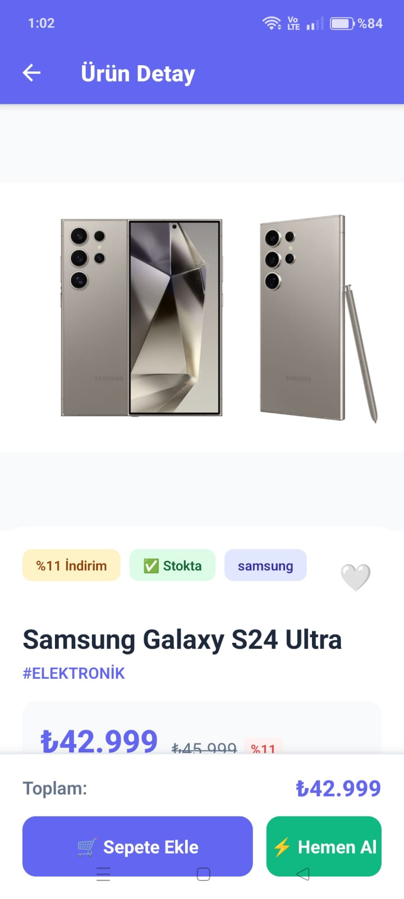

# SmartCommerceAI 🤖🛍️

Bu proje, yapay zeka destekli akıllı bir mobil e-ticaret uygulamasıdır. Kullanıcılara kişiselleştirilmiş ve sezgisel bir alışveriş deneyimi sunmayı hedefler.

## ✨ Özellikler
- 🤖 **AI Alışveriş Asistanı:** Doğal dil işleme ile kullanıcıyı anlar ve akıllı ürün önerileri sunar.
- 🎯 **Kişiselleştirilmiş Akış:** Ana sayfayı ve ürün önerilerini kullanıcının davranışlarına göre dinamik olarak günceller.
- 🛒 **Gelişmiş Sepet ve Favoriler:** Kolayca ürün ekleme, çıkarma ve favorilere kaydetme.
- ✨ **Modern ve Akıcı Arayüz:** Kullanıcı deneyimini en üst düzeye çıkaran sade ve şık tasarım.
- 🔒 **Güvenli Kimlik Doğrulama:** Firebase ile hızlı ve güvenli kullanıcı girişi ve kayıt işlemleri.
- 💳 **Kolay Ödeme Adımları:** Anlaşılır ve basit ödeme süreci ekranları.

## 🛠️ Teknolojiler
- **React Native**
- **TypeScript**
- **Expo**
- **Redux Toolkit** (State Management)
- **Firebase Authentication & Firestore** (Backend & Veritabanı)

## 📱 Ekran Görüntüleri

| Giriş Ekranı | Ana Sayfa | AI Asistan | Ürün Detay | Sepet |
|:---:|:---:|:---:|:---:|:---:|
|  |  |  |  |  |

## 🚀 Kurulum

1. Projeyi bilgisayarınıza klonlayın:
   ```bash
   git clone [https://github.com/MahirKaan/SmartCommerceAI.git](https://github.com/MahirKaan/SmartCommerceAI.git)
